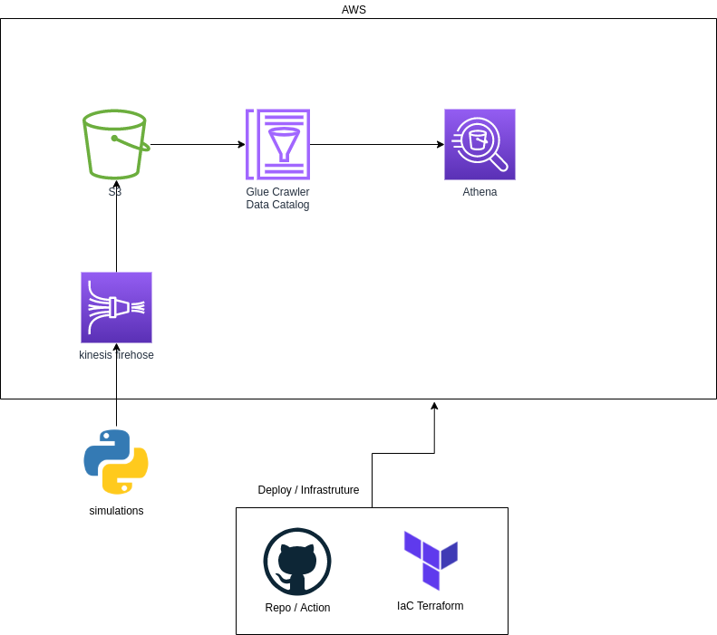

# Processamento Streaming usando Kinesis Firehose 

Implementação de um processamento streaming usando a cloud AWS, infraestrutura como código com Terraform e esteira de deploy com GitHub Actions

O Objetivo dessa arquitetura é processar os dados que serão simulados atraves da lib faker do python em tempo real, realizando um put num kinesis firehose, em seguida será enviado para um bucket s3, mapear os dados usando Glue Crawler e por fim, utilizar o Athena para realizar query sql nos dados.

Abaixo segue o desenho da arquitetura.

